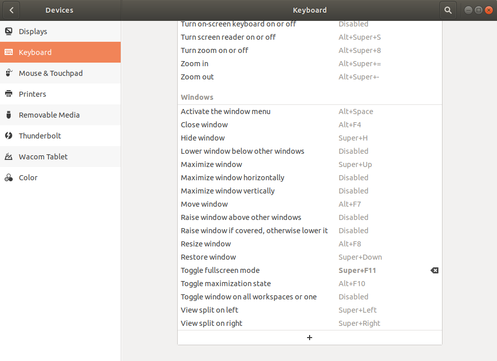
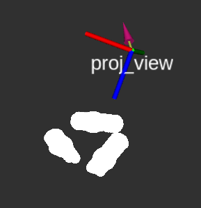
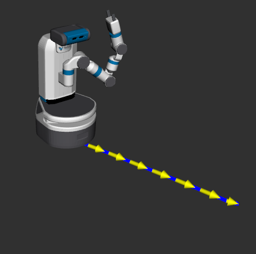
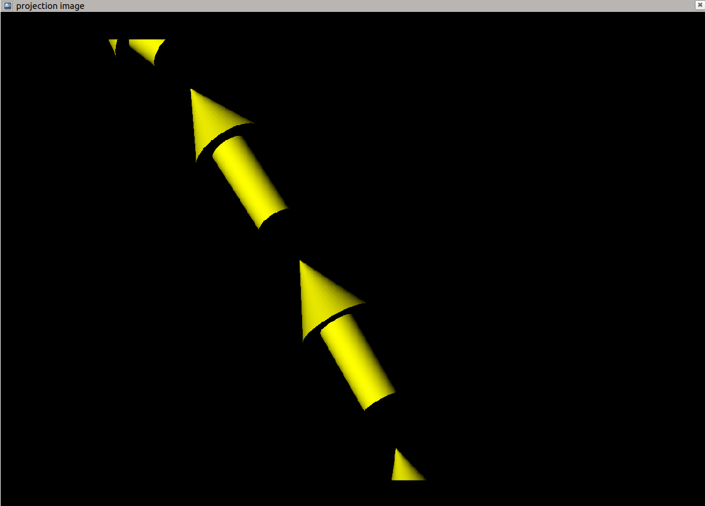

# Projection Mapping Sample: Point Cloud Projection

This package is used to publish a virtual world in Rviz for use on a projector. It also includes a node to turn a navigation path into path of arrows. Feel free to open an issue if you have any questions or encounter any problems. This package was tested with ROS Melodic on Ubuntu 18.04.

It is accompanied with the following paper submitted to AI-HRI 2020:

Projection Mapping Implementation: Enabling Direct Externalization of Perception Results and Action Intent to Improve Robot Explainability. Submitted to the AI-HRI Symposium at AAAI-FSS 2020.

Video:

## Table of Content

 - [Setup](#setup)
 - [Running](#running)
 - [Launch Files](#launch-files)

## Setup

* Download the [`rviz_camera_stream`](https://github.com/uml-robotics/rviz_camera_stream) plugin to your `src` directory: `git clone https://github.com/uml-robotics/rviz_camera_stream.git`
* On Ubuntu, enable a "Toggle fullscreen mode" shortcut `Super + F11` in keyboard settings:

### Fresh Rviz setup
* Change the Fixed Frame to the projector frame
  * See [`launch/tf_publisher.launch`] for an example on how to publish projector frames
  * It is reccommended to add a TF display to see the location of the projector
* Add displays to visualize anything
  * If you plan to project point clouds, add displays for them
  * If you plan to project the navigation MarkerArray, add a MarkerArray display and set the topic to `/visualization_marker_array`
* Add an Image display and set the topic to `/proj_view/image` or your custom image topic
* Add a CameraPub display
  * Set the image topic to `/proj_view/image` and the camera info topic to `/proj_view/camera_info`
    * See [`launch/camera_publisher.launch`] for an example on how to publish a CameraInfo message
  * Under "Visibility", choose what you want visible from `proj_view`

## Running
Notes:
* The fixed frame in the Rviz confing is currently set to `projector_turret_base_link`
* The projection image is the view from the `proj_view` TF frame in Rviz
* `proj_link`'s parent is currently `base_link`
* `projector_camera_info.yaml` is set up for a ViewSonic PA503W projector 
### Projecting Point Clouds
* Launch point cloud projection: `roslaunch point_cloud_projection point_cloud_projection.launch`
  * This will launch both `launch/camera_publisher.launch` and `launch/tf_publisher.launch`
* Run the `fetch_projector.rviz` Rviz config: `roscd point_cloud_projection && rviz -d rviz/fetch_projector.rviz`, or your own rviz config
* Run `image_view` with `rosrun image_view image_view image:=/proj_view/image`
* Make the image fullscreen on the projector screen by pressing `Super + F11`
* The projector should be pointed in the direction of the point cloud either manually or with a pan/tilt unit as described in the paper

### Projecting Navigation Path
* Launch point cloud projection: `roslaunch point_cloud_projection point_cloud_projection.launch`
* Run the marker publishing node: `rosrun point_cloud_projection marker_node` to convert `/move_base/NavfnROS/plan` into a MarkerArray
* Run the `fetch_projector.rviz` Rviz config: `roscd point_cloud_projection && rviz -d rviz/fetch_projector.rviz`, or your own config
* Run `image_view` with `rosrun image_view image_view image:=/proj_view/image`
* Make the image fullscreen on the projector screen by pressing `Super + F11`
* The projector should be pointed at the floor in front of the robot either manually or with a pan/tilt unit as described in the paper

## Launch Files 
`camera_publisher.launch` uses `projector_camera_info.yaml` to publish `/proj_view/camera_info`, which is a topic of type sensor_msgs::CameraInfo

`tf_publisher.launch` creates 2 static transform publishers `proj_link` and `proj_view`. `proj_link` is the center of the bottom of the projector, and `proj_view` is the lense of the projector

`point_cloud_projection.launch` launches both `camera_publisher.launch` and `tf_publisher.launch`
